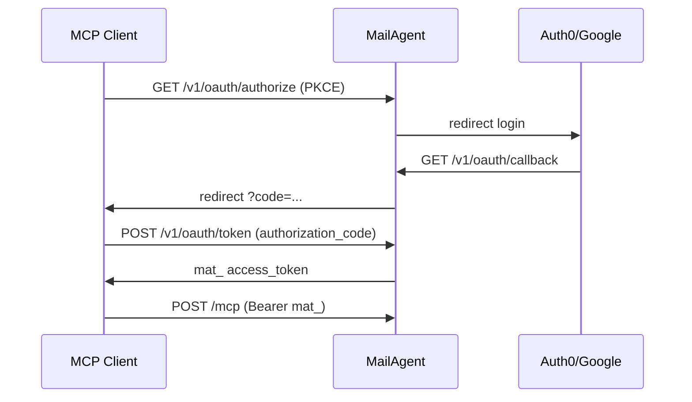

# MCP OAuth via Auth0 / Google (OIDC)

MailAgent can accept **login via external IdP** for remote MCP (Cursor, Claude Desktop) — without manual API key in client config.

## Two OAuth modes

| Mode | When | Flow |
|-------|-------|------|
| **client_credentials** | default | API key → `mat_` token |
| **authorization_code + PKCE** | `OIDC_*` on Worker | Browser login (Auth0/Google) → `mat_` token |

Both can work simultaneously.

**KV quota:** authorize state and auth codes are **stateless JWT** (same `MCP_OAUTH_JWT_SECRET` as `mat_` tokens) — browser login does not consume Cloudflare KV puts.

## Auth0 setup (example)

1. [Auth0 Dashboard](https://manage.auth0.com) → Applications → Create → **Regular Web Application**
2. **Allowed Callback URLs:**
   ```
   https://api.webmailagent.com/v1/oauth/callback
   http://127.0.0.1:8787/v1/oauth/callback
   ```
3. Copy **Domain**, **Client ID**, **Client Secret**

Worker secrets:

```bash
npx wrangler secret put OIDC_ISSUER
# https://YOUR-TENANT.us.auth0.com

npx wrangler secret put OIDC_CLIENT_ID
npx wrangler secret put OIDC_CLIENT_SECRET

# optional for Auth0 API
npx wrangler secret put OIDC_AUDIENCE
```

Locally in `.dev.vars` — same keys.

4. Migrate:

```bash
npm run db:migrate
```

5. Deploy + check discovery:

```bash
curl -sS https://api.webmailagent.com/.well-known/oauth-authorization-server | jq .
# authorization_endpoint, grant_types: authorization_code
```

## Flow (MCP client)



## Endpoints

| Method | Path | Description |
|--------|------|----------|
| GET | `/v1/oauth/authorize` | Start login (PKCE: `redirect_uri`, `state`, `code_challenge`) |
| GET | `/v1/oauth/callback` | Callback from IdP (internal) |
| POST | `/v1/oauth/token` | `grant_type=authorization_code` or `client_credentials` |

### Token exchange (authorization_code)

```bash
curl -sS -X POST https://api.webmailagent.com/v1/oauth/token \
  -H "Content-Type: application/x-www-form-urlencoded" \
  -d "grant_type=authorization_code" \
  -d "code=MAILAGENT_CODE" \
  -d "redirect_uri=http://127.0.0.1:7777/callback" \
  -d "code_verifier=ORIGINAL_VERIFIER"
```

## Teams

First IdP login creates **team `free`** + row in `oidc_identities` (issuer + sub).

Plan changes as usual: `npm run team:plan`, Stripe checkout.

## Google

Use Google OAuth Client (Web) + OIDC issuer `https://accounts.google.com`  
or Auth0 with Google social login (simpler for MCP).

## Without OIDC

If secrets not set — `GET /v1/oauth/authorize` → `501 oidc_not_configured`.  
client_credentials and DCR work as before.

See also [MCP-OAUTH.md](./MCP-OAUTH.md).
