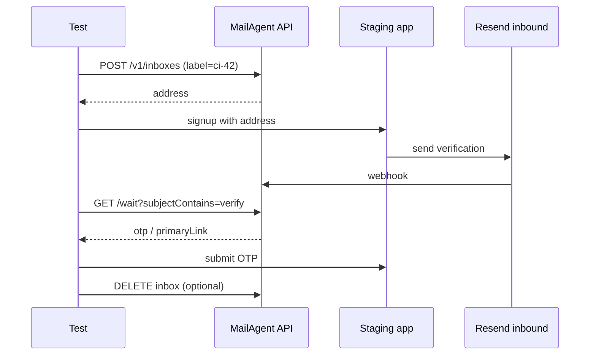

# Plan for QA / E2E testers

What exists, what is critical to add, and in what order.

**Product status for QA:** v1.0 pilot-ready — `@mailagent/qa` on npm, `wizard:qa-pilot`, simulate CI examples.

---

## Already works (use today)

| Capability | How |
|-------------|-----|
| Isolated inbox per run | `label` / `MailAgentQa.runLabel()` |
| Subject filter | `subjectContains` on wait/open |
| Sender allowlist | `service` or `expectFrom` |
| OTP + magic link without HTML parsing | `verification.otp`, `primaryLink` |
| One-shot after submit | `create` → form → `waitForVerification` |
| Debug after failure | `/debug.html`, `GET /v1/inboxes?label=` |
| Webhook in CI | `callbackUrl` + `GET …/callbacks` |
| Playwright SDK | `@mailagent/qa` (local `file:`) |
| Parallel workers | label with worker index + timestamp |
| Agent trace (optional) | `runId` → `agent-{runId}` + `/agent-runs.html` |

Docs: [docs/QA.md](./QA.md), [public/docs/qa.html](https://webmailagent.com/docs/qa.html).

---

## P0 — must-have for QA team (1–2 weeks)

### 1. npm publish `@mailagent/qa` ✅

**Why:** install `npm install @mailagent/qa` without `file:../MailAgent`, versioning, lockfile in test project.

**Do:**
```bash
npm login
npm run publish:qa
```

**Done when:** README in test repo with one-line install.

---

### 2. GitHub Action / GitLab CI template ✅

**Why:** copy-paste job with `MAILAGENT_API_*` secrets, signup test example, inbox id artifact on failure.

**Done:** `examples/github-actions/qa-email.yml` + section in QA.md.

**Done when:** new repo connects MailAgent in 10 minutes.

---

### 3. Playwright global fixture ✅

**Why:** one `test.extend({ mail })` — create/wait/delete automatic, less boilerplate.

**Done:** `examples/playwright/mailagent.fixture.ts` + example in `examples/playwright/`.

**Done when:** 15-line test instead of 40.

---

### 4. Better timeout error ✅

**Why:** on 408 immediately in exception — latest messages (from, subject), inbox id, hint.

**Done:** in `@mailagent/qa@0.1.2+` — `waitForVerification` on timeout calls `list messages` and puts in `MailAgentTimeoutError.details`.

**Done when:** CI log shows «mail did not arrive» vs «arrived but subject mismatch».

---

### 5. Cleanup suite: delete by label prefix ✅

**Why:** after nightly inboxes do not pile up; avoid 10/100 limit.

**API:** `DELETE /v1/inboxes?labelPrefix=ci-123` or SDK `mail.cleanupLabelPrefix("ci-123")` / `mail.cleanupRun("123")`.

---

## P1 — makes life much easier (2–4 weeks)

### 6. Cypress helper ✅

**Why:** half of teams use Cypress, not Playwright.

**Done:** `@mailagent/qa/cypress` — `createMailAgentCypressTasks()`, examples in `examples/cypress/`.

---

### 7. Staging / mock inbound without real SMTP ✅

**Why:** test OTP pipeline without Resend/staging mail dependency.

**Done:** `npm run test:contract:qa`, `test:contract:qa:callback`, `messageIndex` in contract, `simulate-inbound --fire-callback`, CI in `qa-smoke.yml`, `examples/github-actions/contract-qa.yml`.

---

### 8. `service` preset matrix + docs ✅

**Why:** QA knows which preset for staging Auth0 vs prod Auth0.

**Done:** [QA-PRESETS.md](./QA-PRESETS.md).

---

### 9. Callback cookbook (smee.io / webhook.site) ✅

**Why:** async tests without poll — wait for webhook instead of `wait`.

**Done:** [QA-CALLBACK.md](./QA-CALLBACK.md).

---

### 10. Separate QA key and team invite ✅

**Why:** QA team does not share one `API_KEY` with agents.

**Done:** [QA-ONBOARDING.md](./QA-ONBOARDING.md) — `issue:key:db`, dashboard, CI secrets.

---

## P2 — nice-to-have (backlog)

| # | Feature | Status |
|---|------|--------|
| 11 | Retry `waitWithRetry(3)` | ✅ SDK `@mailagent/qa@0.1.5` |
| 12 | `GET …/messages?subjectContains=` | ✅ API + SDK |
| 13 | Allure attachment | ✅ `formatAllureAttachment`, example |
| 14 | Mailosaur / MailSlurp guide | ✅ [QA-MIGRATION.md](./QA-MIGRATION.md) |
| 15 | Rate limit headers | ✅ `X-RateLimit-*`, `Retry-After` |
| 16 | Slack notify on timeout | ✅ `@mailagent/qa/notify`, `ci:mailagent-alerts` |
| 17 | `QA_TTL_MINUTES` env | ✅ SDK |
| 18 | PR comment + screenshot | ✅ PR comment + artifact upload example |

---

## Recommended flow for new QA project



---

## Pilot checklist

Guide: [QA-PILOT.md](./QA-PILOT.md) · `npm run wizard:qa-pilot`

| Step | MailAgent repo | Your test repo |
|------|----------------|----------------|
| API key + smoke | `wizard:qa-pilot` / CI `MAILAGENT_API_KEY` | set secrets |
| Webhook alive | ✅ prod `/webhooks/resend` | staging sends mail |
| `smoke:qa` after deploy | ✅ CI `test:prod:gate` | — |
| `label` per job | documented | `ci-$GITHUB_RUN_ID` |
| Debug on failure | `/debug.html` | copy inbox id |
| Examples | `examples/github-actions/`, `examples/playwright/` | copy workflow |

---

## Pilot success metrics

| Metric | Target |
|---------|------|
| Flaky rate email step | < 2% (after subjectContains + allowlist) |
| Mail wait time p95 | < 90 s |
| Failure debug time | < 5 min (label → debug UI) |
| New repo setup | < 30 min |

---

## Link to agent roadmap

| Agent | QA |
|-------|-----|
| `POST /v1/agent/verify` | Same + `POST /v1/inboxes/open` |
| `runId` | Same as `label` with `agent-` prefix |
| Remote MCP | QA usually REST/SDK |
| `@mailagent/agent` | `@mailagent/qa` for tests |

---

## Next step (v0.10)

**P0–P2 and v0.9 done.** `@mailagent/qa@0.1.9` on npm.

1. `npm run publish:agent` → `@mailagent/agent@0.1.5` (`messageIndex` in verify)
2. MailAgent GitHub repo: secrets `MAILAGENT_API_KEY`, `DATABASE_URL` → contract in CI on PR
3. `npm run doctor` / `smoke:qa` / `test:contract:qa` — periodically after deploy
4. Optional: attachment E2E example, Netlify redeploy for updated `public/docs/qa.html`

Agent/OIDC/billing — see [ROADMAP.md](./ROADMAP.md) "Deferred".
