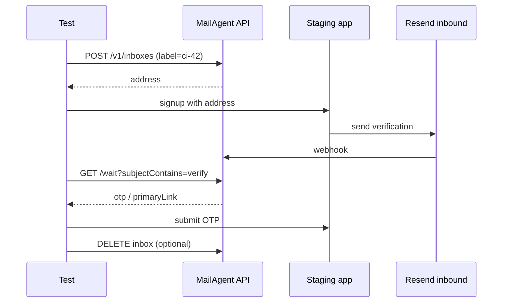

# План для QA / E2E-тестировщиков

Что уже есть, что критично добавить, и в каком порядке.

**Статус продукта для QA:** v0.3 — можно пилотить в CI, есть SDK и debug UI.

---

## Уже работает (можно использовать сегодня)

| Возможность | Как |
|-------------|-----|
| Изолированный inbox на прогон | `label` / `MailAgentQa.runLabel()` |
| Фильтр по теме письма | `subjectContains` на wait/open |
| Allowlist отправителя | `service` или `expectFrom` |
| OTP + magic link без парсинга HTML | `verification.otp`, `primaryLink` |
| One-shot после submit | `create` → форма → `waitForVerification` |
| Отладка после падения | `/debug.html`, `GET /v1/inboxes?label=` |
| Webhook в CI | `callbackUrl` + `GET …/callbacks` |
| Playwright SDK | `@mailagent/qa` (локально `file:`) |
| Параллельные воркеры | label с worker index + timestamp |
| Agent trace (опционально) | `runId` → `agent-{runId}` + `/agent-runs.html` |

Документация: [docs/QA.md](./QA.md), [public/docs/qa.html](https://webmailagent.com/docs/qa.html).

---

## P0 — must-have для команды QA (1–2 недели)

### 1. npm publish `@mailagent/qa` ✅

**Зачем:** установка `npm install @mailagent/qa` без `file:../MailAgent`, версионирование, lockfile в проекте тестов.

**Сделать:**
```bash
npm login
npm run publish:qa
```

**Критерий готовности:** README в репо тестов с одной строкой install.

---

### 2. GitHub Action / GitLab CI template ✅

**Зачем:** copy-paste job с секретами `MAILAGENT_API_*`, пример signup-теста, артефакт inbox id при падении.

**Сделать:** `examples/github-actions/qa-email.yml` + секция в QA.md.

**Критерий:** новый репозиторий подключает MailAgent за 10 минут.

---

### 3. Playwright global fixture ✅

**Зачем:** один `test.extend({ mail })` — create/wait/delete автоматически, меньше boilerplate.

**Сделать:** `examples/playwright/mailagent.fixture.ts` + пример в `examples/playwright/`.

**Критерий:** тест из 15 строк вместо 40.

---

### 4. Улучшенная ошибка при timeout ✅

**Зачем:** при 408 сразу в exception — последние messages (from, subject), inbox id, hint.

**Сделано:** в `@mailagent/qa@0.1.2+` — `waitForVerification` при timeout вызывает `list messages` и кладёт в `MailAgentTimeoutError.details`.

**Критерий:** в CI log видно «письмо не пришло» vs «пришло, но subject не матчится».

---

### 5. Cleanup suite: delete by label prefix ✅

**Зачем:** после nightly не копятся inbox; не упираться в лимит 10/100.

**API:** `DELETE /v1/inboxes?labelPrefix=ci-123` или SDK `mail.cleanupLabelPrefix("ci-123")` / `mail.cleanupRun("123")`.

---

## P1 — сильно упрощает жизнь (2–4 недели)

### 6. Cypress helper ✅

**Зачем:** половина команд на Cypress, не Playwright.

**Сделано:** `@mailagent/qa/cypress` — `createMailAgentCypressTasks()`, примеры в `examples/cypress/`.

---

### 7. Staging / mock inbound без реального SMTP ✅

**Зачем:** тестировать пайплайн OTP без зависимости от Resend/staging-почты.

**Сделано:** `npm run test:contract:qa`, `scripts/contract-qa.mjs`, `examples/github-actions/contract-qa.yml`.

---

### 8. Матрица `service` presets + документация ✅

**Зачем:** QA знает, какой preset для staging Auth0 vs prod Auth0.

**Сделано:** [QA-PRESETS.md](./QA-PRESETS.md).

---

### 9. Callback cookbook (smee.io / webhook.site) ✅

**Зачем:** async тесты без poll — ждать webhook вместо `wait`.

**Сделано:** [QA-CALLBACK.md](./QA-CALLBACK.md).

---

### 10. Отдельный QA-ключ и team invite ✅

**Зачем:** QA-команда не делит один `API_KEY` с агентами.

**Сделано:** [QA-ONBOARDING.md](./QA-ONBOARDING.md) — `issue:key:db`, dashboard, CI secrets.

---

## P2 — nice-to-have (backlog)

| # | Фича | Статус |
|---|------|--------|
| 11 | Retry `waitWithRetry(3)` | ✅ SDK `@mailagent/qa@0.1.5` |
| 12 | `GET …/messages?subjectContains=` | ✅ API + SDK |
| 13 | Allure attachment | ✅ `formatAllureAttachment`, example |
| 14 | Mailosaur / MailSlurp guide | ✅ [QA-MIGRATION.md](./QA-MIGRATION.md) |
| 15 | Rate limit headers | ✅ `X-RateLimit-*`, `Retry-After` |
| 16 | Slack notify on timeout | ✅ `@mailagent/qa/notify`, `ci:mailagent-alerts` |
| 17 | `QA_TTL_MINUTES` env | ✅ SDK |
| 18 | PR comment + screenshot | ✅ PR comment + artifact upload example |

---

## Рекомендуемый flow для нового проекта QA



---

## Чеклист перед пилотом QA

- [ ] `MAILAGENT_API_URL` + `MAILAGENT_API_KEY` в CI secrets
- [ ] Staging шлёт письма с домена из `service` preset
- [ ] Resend webhook → `/webhooks/resend` жив (health + тестовое письмо)
- [ ] `label` уникален на job (`GITHUB_RUN_ID`, worker index)
- [ ] `deleteAfter: false` на отладку, `true` в prod CI
- [ ] При падении — `/debug.html` или `GET /v1/inboxes?label=`
- [ ] `npm run smoke:qa` зелёный после деплоя
- [ ] `npm run smoke:agent` зелёный после деплоя

---

## Метрики успеха пилота

| Метрика | Цель |
|---------|------|
| Flaky rate email step | < 2% (после subjectContains + allowlist) |
| Время ожидания письма p95 | < 90 s |
| Время отладки падения | < 5 min (label → debug UI) |
| Setup нового репо | < 30 min |

---

## Связь с agent roadmap

| Agent | QA |
|-------|-----|
| `POST /v1/agent/verify` | То же + `POST /v1/inboxes/open` |
| `runId` | Аналог `label` с префиксом `agent-` |
| Remote MCP | QA обычно REST/SDK |
| `@mailagent/agent` | `@mailagent/qa` для тестов |

---

## Следующий шаг (рекомендация)

**P1 закрыт.** **P2 (ядро)** — retry, messages filter, rate headers, migration guide, Allure.

Дальше по желанию:

1. `npm run deploy` + `npm run publish:qa` → `@mailagent/qa@0.1.5`
2. P2 backlog: Slack alert, PR comment bot (внешние интеграции)
3. Agent: MCP OAuth, Streamable HTTP ✅ (Bearer + sessions; OAuth IdP backlog)
